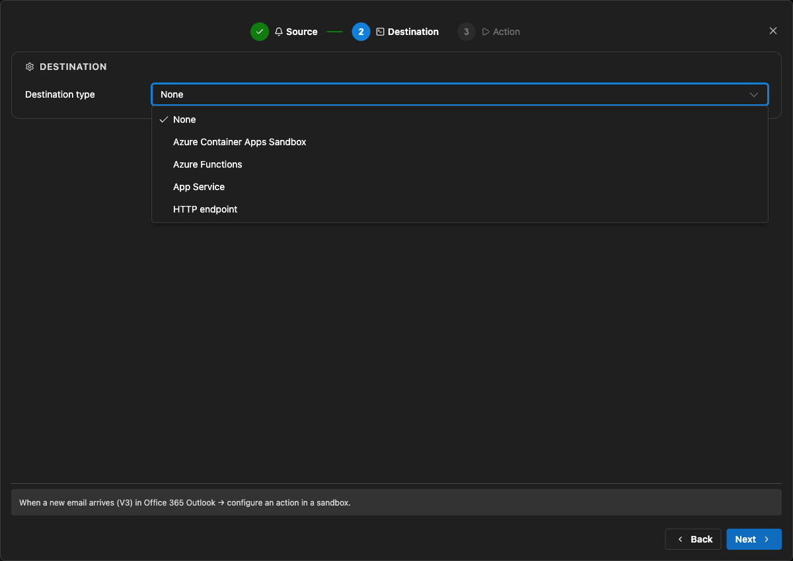
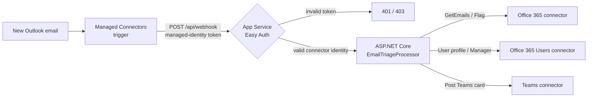

# Managed Connectors on Azure App Service - M365 Email Triage

This sample demonstrates the **Azure Managed Connectors public-preview capability to
use Azure App Service as a trigger destination**. App Service is the host for the
callback; this sample does not introduce or depend on a separate App Service preview.

It ports the Azure Functions end-to-end sample
[`functions-connectors-net-e2e-email-users-teams`](https://github.com/Azure-Samples/functions-connectors-net-e2e-email-users-teams)
to an ordinary ASP.NET Core web app:

> When a new email arrives in a monitored Office 365 mailbox, classify its importance.
> For important mail, enrich the sender through Office 365 Users, post a triage card to
> Microsoft Teams, and set an Outlook follow-up flag on the source message.

The complete flow has been validated with the first-class App Service destination:
Easy Auth accepted the managed-identity callback, the app posted the Teams card, and
the source Outlook message was flagged.

## What the App Service destination provides

When creating a trigger in the
[Managed Connectors portal](https://connectors.azure.com), select **App Service** as
the destination instead of entering a generic callback URL.



The wizard:

- Lets you select an existing App Service app.
- Defaults the callback to `POST https://<app>.azurewebsites.net/api/webhook`. You can
  edit the route after creating the trigger.
- Uses the Connector Namespace user-assigned managed identity to request an Entra ID
  token for the audience you provide.
- Records App Service destination metadata on the trigger for display and lifecycle
  management.

The wizard does **not** configure authentication on the receiving app. This sample's
Bicep configures App Service built-in authentication (Easy Auth) to validate the
connector token before the request reaches ASP.NET Core.

## Architecture



The inbound trigger and outbound actions are separate:

- **Inbound:** Managed Connectors delivers the event to the App Service destination.
  Easy Auth validates the managed-identity token's signature, issuer, audience, and
  caller object ID.
- **Outbound:** `Office365Client`, `Office365UsersClient`, and `TeamsClient` from
  `Azure.Connectors.Sdk` use the web app's managed identity and the connection runtime
  URLs provisioned by Bicep.

## What changed from the Functions sample

| Azure Functions sample | App Service sample |
| --- | --- |
| `[ConnectorTrigger]` binding | ASP.NET Core `POST /api/webhook` endpoint |
| Azure Functions destination | Managed Connectors **App Service** destination |
| Functions isolated worker | `WebApplication.CreateBuilder(...)` |
| Function app | Linux App Service web app |
| Functions webhook key | Easy Auth validating a managed-identity token |

`POST /api/onNewEmail` remains as a compatibility alias for trigger configurations
created with the earlier generic HTTP endpoint flow.

## Repository layout

```text
.
|-- azure.yaml
|-- docs/images/
|-- infra/
|   |-- app/entra.bicep
|   |-- connectorNamespace.bicep
|   |-- main.bicep
|   `-- scripts/postdeploy.sh
|-- src/
|   |-- Program.cs
|   |-- EmailTriageProcessor.cs
|   `-- ImportanceClassifier.cs
`-- test.http
```

## Prerequisites

- An Azure subscription with permission to deploy the resources in this sample.
- [Azure Developer CLI (`azd`)](https://aka.ms/azd),
  [Azure CLI (`az`)](https://aka.ms/azcli), `jq`, and the .NET 10 SDK.
- A Microsoft 365 mailbox for the Outlook connection.
- A Microsoft Teams team and channel where the sample can post triage cards.

Connector Namespace is currently available in `westcentralus`; the rest of the
deployment can use another Azure region.

## Deploy

```bash
azd auth login
az login

azd env new
azd env set TEAMS_TEAM_ID "<team-group-id>"
azd env set TEAMS_CHANNEL_ID "<channel-id>"

# Optional classifier settings
# azd env set IMPORTANT_SENDERS "boss@contoso.com,ceo@contoso.com"
# azd env set INTERNAL_DOMAINS "contoso.com"

# Set this only when required by your tenant.
# azd env set SERVICE_MANAGEMENT_REFERENCE "<service-tree-guid>"

azd up
```

The post-deployment script opens the OAuth consent flow for the Office 365 Outlook,
Teams, and Office 365 Users connections. Sign in to the Office 365 connection with the
mailbox whose Inbox you want to monitor.

> **Re-deploying?** The Connector Namespace resource provider currently rejects identity
> updates. After the first successful provision, run
> `azd env set CREATE_CONNECTOR_NAMESPACE false` before the next `azd up`.

## Create the App Service trigger

After deployment, the post-deployment script prints the Managed Connectors portal URL,
the App Service name, and the audience value.

1. Open the printed portal URL and select **Create trigger**.
2. Choose **Office 365 Outlook** > **When a new email arrives (V3)** and select the
   deployed Office 365 connection.
3. For **Destination type**, choose **App Service** and select the deployed web app.
4. Enter the printed `entraAppIdentifierUri` value in **Audience**.
5. Create the trigger. The wizard defaults the callback to `POST /api/webhook`; edit the
   trigger afterward if your application uses a different route.

## Validate end to end

First confirm that the callback is not publicly callable:

```bash
curl -i https://<app>.azurewebsites.net/api/webhook
```

Expect `401 Unauthorized` from Easy Auth.

Then send an important-looking email to the connected mailbox. The expected result is:

1. The trigger run reports a successful callback.
2. A triage card appears in the configured Teams channel.
3. The source email is flagged for follow-up in Outlook.
4. Processing traces appear in Application Insights.

Stream application logs with:

```bash
az webapp log tail --resource-group <resource-group> --name <app>
```

## Run locally

Easy Auth runs only in Azure. For local development, authenticate with Azure CLI,
provide the connection runtime URLs and Teams IDs, and send the requests in
`test.http`.

```bash
az login
cp .env.sample .env
dotnet run --project ./src
```

## Current limitations

- Managed Connectors, including the App Service trigger destination, is in public
  preview.
- Trigger creation and connection management happen in the Managed Connectors portal,
  not the App Service portal.
- The App Service destination defaults to `/api/webhook`. Changing the route requires
  editing the trigger after creation.
- The receiving app's Easy Auth trust is not configured by the trigger wizard. This
  sample provisions the required app registration, federated credential, audience,
  and allowed connector identity.
- Easy Auth's `requireAuthentication` setting protects the whole app, not only the
  connector callback route.
- This sample validates a push trigger. It does not validate every connector or trigger
  type.
