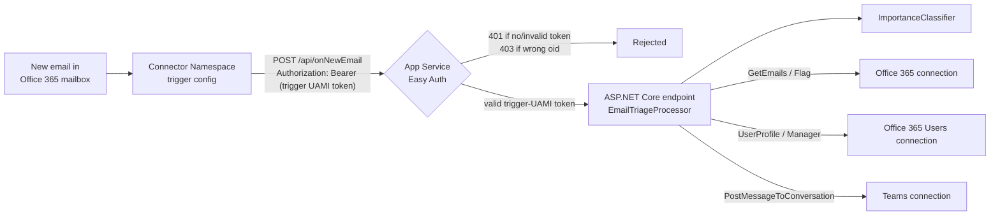

# Managed Connectors on Azure App Service — M365 Email Triage

This sample **validates that Azure Managed Connectors (Connector Namespace) work on a
plain Azure App Service Web App**, not just on Azure Functions.

It is a port of the Azure Functions end-to-end sample
[`functions-connectors-net-e2e-email-users-teams`](https://github.com/Azure-Samples/functions-connectors-net-e2e-email-users-teams).
The business scenario is identical:

> When a new email arrives in a monitored Office 365 mailbox → classify its importance →
> for important mail, enrich the sender via **Office 365 Users**, post a triage card to
> **Microsoft Teams**, and set an Outlook **follow-up flag** on the source message.

The only thing that changed is the **host**: instead of an Azure Functions app with a
`[ConnectorTrigger]` binding, the connector callback lands on an ordinary ASP.NET Core
`POST /api/onNewEmail` endpoint running on App Service.

## Why this works (the thing being validated)

A Connector Namespace **trigger config** delivers events by POSTing to any
`notificationDetails.callbackUrl`. It can attach a real **Entra ID bearer token** to that
POST via `authentication.type = "ManagedServiceIdentity"` (minted from a user-assigned
managed identity attached to the namespace). **This is compute-agnostic — it does not
require the Functions runtime or a Functions system key.**

On the receiving side, this sample secures the endpoint with **App Service built-in
authentication (Easy Auth / `authsettingsV2`)**, which validates that token at the
platform edge — signature, issuer, audience, and that the caller's object id equals the
trigger UAMI's principal id (`defaultAuthorizationPolicy.allowedPrincipals.identities`).
Easy Auth is a **shared App Service platform feature**, available on Web Apps and Function
Apps alike, so it works here on a plain Web App.

The **outbound** connector clients (`Office365Client`, `TeamsClient`,
`Office365UsersClient`) and the trigger payload type (`Office365OnNewEmailTriggerPayload`)
come from `Azure.Connectors.Sdk`. They only need a connection runtime URL + a
`TokenCredential` (the web app's managed identity), so they are already fully portable —
they move to App Service with **zero code changes**.



## What is Functions-specific and how it was replaced

| Azure Functions sample | App Service replacement (this sample) |
| --- | --- |
| `[ConnectorTrigger] Office365OnNewEmailTriggerPayload` binding | ASP.NET Core `POST /api/onNewEmail` that `ReadFromJsonAsync<Office365OnNewEmailTriggerPayload>()` |
| `/runtime/webhooks/connector?functionName=…&code=<system key>` | Plain route `https://<app>.azurewebsites.net/api/onNewEmail`, **no system key** |
| `connector_extension` system key as the auth boundary | **Easy Auth** (`authsettingsV2`) validating the trigger UAMI's Entra token |
| `ConfigureFunctionsWebApplication()` isolated host | `WebApplication.CreateBuilder(...)` (`Microsoft.NET.Sdk.Web`) |
| Flex Consumption function app (`kind: functionapp,linux`, `FC1`) | App Service plan (Linux, `B1`, `alwaysOn`) + Web App (`kind: app,linux`, `DOTNETCORE\|10.0`) |
| `AzureWebJobsStorage` + deployment storage container | Not needed (azd zip/oryx deploy) |

The connector **trigger config** is also created differently. Instead of pointing at the
Functions webhook path with a `code=` system key, `infra/scripts/postdeploy.sh` PUTs a
trigger config whose `callbackUrl` is the plain App Service route and whose
`notificationDetails.authentication` is `ManagedServiceIdentity` (see below).

## Layout

```
email-triage-appservice/
├─ azure.yaml                     # azd: host: appservice, language: dotnet, service "web"
├─ src/
│  ├─ EmailTriage.AppService.csproj  # Microsoft.NET.Sdk.Web, net10.0, Azure.Connectors.Sdk
│  ├─ Program.cs                  # WebApplication host; maps POST /api/onNewEmail + /healthz
│  ├─ EmailTriageProcessor.cs     # ported ProcessEmail pipeline (classify→enrich→Teams→flag)
│  └─ ImportanceClassifier.cs     # copied verbatim from the Functions sample
├─ infra/
│  ├─ main.bicep                  # RG, plan, Web App, Easy Auth, App Insights, identities
│  ├─ connectorNamespace.bicep    # Connector Namespace + 3 connections + access policies
│  ├─ app/entra.bicep             # Entra app reg + SP + FIC to the web app MI
│  ├─ main.parameters.json
│  └─ scripts/postdeploy.{sh,ps1} # create MSI-auth trigger config + OAuth-consent connections
├─ test.http                      # local + cloud callback test requests
└─ .env.sample
```

## Prerequisites

- An Azure subscription (Owner/Contributor on the target scope).
- [Azure Developer CLI (`azd`)](https://aka.ms/azd), [Azure CLI (`az`)](https://aka.ms/azcli),
  `jq`, and the .NET 10 SDK.
- A Microsoft 365 mailbox you can consent with (the Inbox to monitor), and a **Teams team
  + channel** to post triage cards to. You need the Team's `groupId` and the `channelId`.
- Connector Namespace is in preview and is pinned to **`westcentralus`** by `main.bicep`.
  Deploy the rest anywhere; the namespace module overrides its own location.

## Deploy

```bash
cd email-triage-appservice

# 1. Sign in
azd auth login
az login

# 2. Set the Teams target (required) and optional classifier tuning
azd env new                      # or: azd env select <name>
azd env set TEAMS_TEAM_ID    "<team-groupId>"
azd env set TEAMS_CHANNEL_ID "<channelId>"
# optional:
# azd env set IMPORTANT_SENDERS "boss@contoso.com,ceo@contoso.com"
# azd env set INTERNAL_DOMAINS  "contoso.com"
# azd env set SERVICE_MANAGEMENT_REFERENCE "<service-tree-guid>"   # if your tenant requires it

# 3. Provision + deploy + run postdeploy (creates the trigger config, walks OAuth consent)
azd up
```

During `postdeploy` a browser tab opens **three times** — sign in / consent for the
Office 365 Outlook, Teams, and Office 365 Users connections. Sign in to the Office 365
connection with the mailbox whose Inbox you want to monitor.

> **Re-deploying?** The Connector Namespace RP rejects `identity` on update PUTs, so after
> the first successful provision run `azd env set CREATE_CONNECTOR_NAMESPACE false` before
> the next `azd up` (references the namespace as `existing`).

## Validate end to end

1. **Security boundary** — confirm the endpoint is not open:
   ```bash
   curl -i https://<app>.azurewebsites.net/api/onNewEmail        # expect: 401 (Easy Auth)
   ```
   A 401 here is the proof that only the trigger's MI-authenticated callback gets through.
2. **Trigger it** — send an email to the monitored mailbox. Make it look important (e.g.
   from a sender in `IMPORTANT_SENDERS`, subject like `Urgent: …`, a deadline/ask in the
   body).
3. **Observe the results**:
   - A **triage card** appears in the configured Teams channel (labeled “via App Service”).
   - The **source email is flagged** for follow-up in Outlook.
   - Logs show the classification + calls:
     ```bash
     az webapp log tail -g <rg> -n <app>
     ```
     and traces land in Application Insights.

## Run locally

Easy Auth only exists in Azure, so locally the endpoint is open and you POST the sample
payloads directly:

```bash
az login                                  # DefaultAzureCredential uses this for connector calls
cp .env.sample .env                       # fill in the 3 RUNTIME_URLs + Teams IDs (from azd env get-values)
dotnet run --project ./src                # http://localhost:5280
# then send the LOCAL requests in test.http
```

## Notes / caveats

- **Callback timeout:** the connector runtime expects a timely `2xx`. Like the Functions
  original, this sample processes inline and returns `200`. If the connector enforces a
  short timeout under load, switch the endpoint to return `202` and process in the
  background.
- **`entra.bicep`** keeps its `functionAppHostname` parameter name from the source sample;
  the value passed in is the App Service hostname (the `/.auth/login/aad/callback`
  redirect URI is identical for Web Apps and Function Apps).
- This is a **validation sample**, not production-hardened. It uses `B1` and in-memory
  caches; scale/secure appropriately for real workloads.
